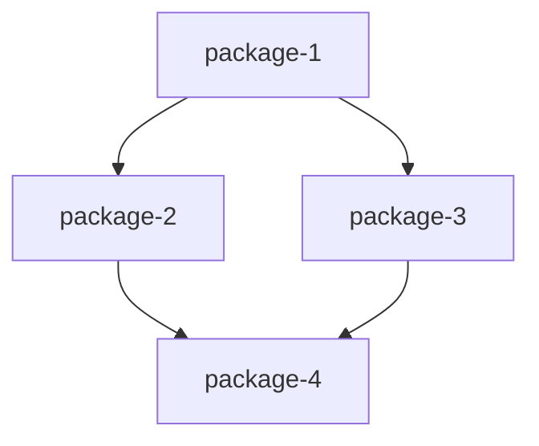

# Mapping : [Nom du projet]

## Vue d'ensemble

[Resume du decoupage en une phrase]

**Nombre de packages** : N
**Approche de decoupage** : [Domaine/Feature/Couche/Hybride]

---

## Packages identifies

### Package 1 : [nom-package-1]

**Perimetre** : [Description du scope en 1-2 phrases]

**Exigences couvertes** :
- REQ-F001 : [Description courte]
- REQ-F002 : [Description courte]
- REQ-NF001 : [Description courte]

**Contraintes applicables** :
- REQ-C001 : [Description courte]

**Dependances entrantes** : [packages qui dependent de celui-ci]
**Dependances sortantes** : [packages dont celui-ci depend]

**Complexite estimee** : Faible / Moyenne / Elevee
**Risques identifies** :
- [Risque 1]
- [Risque 2]

---

### Package 2 : [nom-package-2]

**Perimetre** : [Description du scope en 1-2 phrases]

**Exigences couvertes** :
- REQ-F010 : [Description courte]
- REQ-F011 : [Description courte]

**Contraintes applicables** :
- REQ-C001 : [Description courte]

**Dependances entrantes** : [packages qui dependent de celui-ci]
**Dependances sortantes** : [packages dont celui-ci depend]

**Complexite estimee** : Faible / Moyenne / Elevee
**Risques identifies** :
- [Risque 1]

---

## Matrice de mapping

| Exigence | Package(s) | Type |
|----------|------------|------|
| REQ-F001 | auth | Fonctionnel |
| REQ-F002 | auth, api | Fonctionnel |
| REQ-F010 | core | Fonctionnel |
| REQ-NF001 | (transverse) | Non-fonctionnel |
| REQ-C001 | (tous) | Contrainte |

### Exigences transverses

- **REQ-NF001** : [Description] - Packages concernes : [liste]
- **REQ-NF002** : [Description] - Packages concernes : [liste]

### Exigences orphelines

Aucune exigence identifiee dans requirements.md n'est orpheline.

_Ou si des exigences sont hors scope :_

- **REQ-F050** : [Description] - Raison : [Justification du report]

---

## Graphe de dependances

### Dependances detaillees

| De | Vers | Type | Description |
|----|------|------|-------------|
| auth | api | Technique | Auth fournit les tokens pour API |
| core | auth | Fonctionnelle | Core a besoin de l'utilisateur connecte |
| api | core | Technique | API expose les services de Core |

---

## Ordre d'implementation suggere

### Vague 1 (Fondations)

1. **[package-1]** - [Justification : pas de dependances, prerequis pour les autres]

### Vague 2 (Core)

2. **[package-2]** - [Justification : depend de package-1, apporte la valeur principale]
3. **[package-3]** - [Justification : peut etre parallele avec package-2]

### Vague 3 (Features)

4. **[package-4]** - [Justification : depend de package-2 et package-3]

### Opportunites de parallelisation

- Vague 2 : package-2 et package-3 peuvent etre developpes en parallele
- [Autres opportunites]

---

## Notes

[Observations ou decisions importantes prises lors du decoupage]

---

_Genere par Splitter le [date]_
