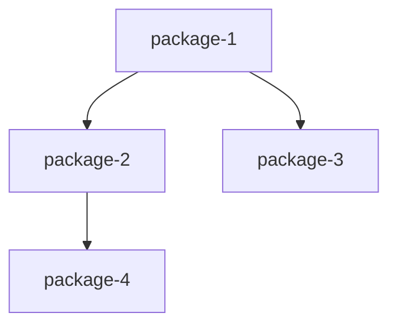

# Plan Détaillé - Phase 5 : Création du Splitter

## Position dans le workflow v2

```
Brainstormer → PRD → Specifier → Architect → SPLITTER → Shaper → Executor → Verifier
```

**Question centrale** : "Comment découper en packages livrables ?"

---

## 1. Structure de l'agent `agents/ship-splitter.md`

### Frontmatter

```yaml
---
name: ship-splitter
description: "Découpe le projet en packages livrables et mappe les exigences."
model: opus
skills: ship-splitting, ship-writing
user-invocable: false
---
```

### Ce que l'agent fait

1. Lire requirements.md, architecture.md, prd.md
2. Identifier les frontières naturelles
3. Proposer un découpage initial
4. Valider avec l'utilisateur (nombre, nommage, périmètre)
5. Créer le mapping exigences ↔ packages
6. Identifier les dépendances
7. Suggérer l'ordre d'implémentation
8. Produire packages/mapping.md

### Ce que l'agent ne fait PAS

- Ne planifie pas les scopes (job du Shaper)
- Ne décide pas de l'implémentation (job de l'Executor)
- Ne modifie pas les exigences (job du Specifier)
- Ne change pas l'architecture (job de l'Architect)

### Workflow

```
Étape 1: Lecture des inputs
    ├── .ship/requirements.md (obligatoire)
    ├── .ship/architecture.md (obligatoire)
    └── .ship/prd.md (contexte)

Étape 2: Analyse des frontières naturelles
    ├── Identifier domaines métier
    ├── Identifier features utilisateur
    ├── Analyser couches techniques
    └── Repérer les composants isolés

Étape 3: Proposition de découpage
    ├── Présenter N packages identifiés
    ├── Justifier chaque frontière
    └── AskUserQuestion pour validation

Étape 4: Mapping exigences → packages
    ├── Associer chaque REQ-* à un package
    ├── Identifier exigences transverses
    └── Signaler exigences orphelines

Étape 5: Analyse des dépendances
    ├── Dépendances techniques (code)
    ├── Dépendances fonctionnelles (données)
    └── Créer graphe de dépendances

Étape 6: Ordre d'implémentation
    ├── Tri topologique sur le graphe
    ├── Prioriser par valeur business
    └── Proposer séquence

Étape 7: Production du mapping.md
```

### Techniques de découpage

- Par domaine métier (DDD - Bounded Contexts)
- Par feature utilisateur (Feature Teams)
- Par couche technique (horizontal slicing)
- Par niveau de risque (risk-first)
- Par dépendance (dependency-driven)

---

## 2. Structure de la commande `commands/ship/split.md`

### Frontmatter

```yaml
---
name: ship:split
description: "Lance le découpage du projet en packages"
---
```

### Syntaxe

```
/ship:split
```

### Prerequisites

- `.ship/requirements.md` (obligatoire)
- `.ship/architecture.md` (obligatoire)
- `.ship/prd.md` (recommandé)

### Output

`.ship/packages/mapping.md`

---

## 3. Format du fichier `mapping.md`

```markdown
# Mapping : [Nom du projet]

## Vue d'ensemble

[Résumé du découpage en une phrase]

**Nombre de packages** : N
**Approche de découpage** : [Domaine/Feature/Couche/Hybride]

---

## Packages identifiés

### Package 1 : [nom-package-1]

**Périmètre** : [Description du scope]

**Exigences couvertes** :
- REQ-F001 : [Description courte]
- REQ-F002 : [Description courte]
- REQ-NF001 : [Description courte]

**Contraintes applicables** :
- REQ-C001 : [Description courte]

**Dépendances entrantes** : [packages qui dépendent de celui-ci]
**Dépendances sortantes** : [packages dont celui-ci dépend]

**Complexité estimée** : Faible / Moyenne / Élevée
**Risques identifiés** : [Liste des risques spécifiques]

---

## Matrice de mapping

| Exigence | Package(s) | Type |
|----------|------------|------|
| REQ-F001 | auth | Fonctionnel |
| REQ-F002 | auth, api | Fonctionnel |
| REQ-NF001 | (transverse) | Non-fonctionnel |
| REQ-C001 | (tous) | Contrainte |

### Exigences transverses

- **REQ-NF001** : [Description] - Packages concernés : [liste]

### Exigences orphelines

Aucune exigence identifiée dans requirements.md n'est orpheline.

---

## Graphe de dépendances



### Dépendances détaillées

| De | Vers | Type | Description |
|----|------|------|-------------|
| auth | api | Technique | Auth fournit les tokens pour API |

---

## Ordre d'implémentation suggéré

### Vague 1 (Fondations)
1. **[package-1]** - [Justification]

### Vague 2 (Core)
2. **[package-2]** - [Justification]

### Vague 3 (Features)
3. **[package-3]** - [Justification]

---

_Généré par Splitter le [date]_
```

---

## 4. Critères de découpage

### Critères primaires (obligatoires)

1. **Indépendance de déploiement** : Chaque package peut être déployé seul
2. **Couplage minimal** : Interfaces claires, dépendances explicites, pas de cycles
3. **Couverture des exigences** : Toute exigence mappée à au moins un package

### Critères secondaires (recommandés)

4. **Taille homogène** : Éviter un package géant et plusieurs petits
5. **Alignement métier** : Un package = un domaine métier cohérent
6. **Testabilité** : Le package peut être testé isolément

### Heuristiques

| Signal | Suggestion |
|--------|------------|
| Même entité métier manipulée | Même package |
| Même utilisateur cible | Même package ou adjacent |
| Couche technique différente | Packages séparés |
| Déploiement indépendant nécessaire | Packages séparés |

### Anti-patterns à éviter

- **Package fourre-tout** : Un "misc" qui grandit indéfiniment
- **Découpage prématuré** : Trop de petits packages
- **Dépendance circulaire** : A dépend de B qui dépend de A
- **Exigence écartée** : Pas d'exigence hors scope sans justification

---

## 5. Gestion des dépendances

### Types de dépendances

1. **Techniques (code)** : Import de modules, interfaces partagées
2. **Fonctionnelles (données)** : Production/consommation de données
3. **Déploiement** : Infrastructure partagée, ordre de déploiement

### Règles

1. **Unidirectionnelles** : Pas de cycles, DAG
2. **Explicites** : Documentées dans mapping.md
3. **Minimisées** : Préférer interfaces aux implémentations

### Algorithme d'ordonnancement

```
1. Construire le graphe de dépendances
2. Détecter les cycles (erreur si présent)
3. Tri topologique pour l'ordre de base
4. Ajuster par priorité business
5. Identifier opportunités de parallélisation
6. Grouper en "vagues" d'implémentation
```

---

## 6. Fichiers à créer

| Fichier | Description |
|---------|-------------|
| `agents/ship-splitter.md` | Agent principal |
| `commands/ship/split.md` | Commande /ship:split |

---

## 7. Critères de validation

1. L'agent suit le pattern des agents existants
2. La commande vérifie les prerequisites et lance l'agent
3. L'output mapping.md couvre :
   - Liste des packages avec périmètre
   - Mapping exigences ↔ packages complet
   - Graphe de dépendances
   - Ordre d'implémentation suggéré
4. Aucune dépendance circulaire possible
5. Toutes les exigences sont mappées ou justifiées
